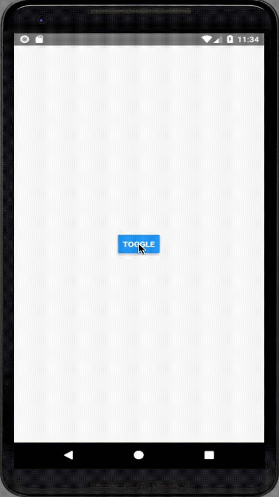

# react-native-easy-snackbar

[](https://github.com/prettier/prettier)

Easy to use snackbar component for iOS and Android.

Snackbar provides feedback about an operation through a message at the bottom of the screen. They could also have an optional action.

Snackbar could be rendered at any level of nesting, but it'll appear at same level as the root component.

## Usage

1. Wrap the root level elements in a `Snackbar.Host` to render the snackbars above the rest of the children.

```js
// App.js

import * as React from 'react';
import { Text, View } from 'react-native';
import Snackbar from 'react-native-easy-snackbar';

import Notification from './Notification';

const App = () => {
  return (
    <Snackbar.Host>
      <View>
        <Text>Welcome to the desert of the real</Text>
        <Notification show={true} />
      </View>
    </Snackbar.Host>
  );
};
```

2. Use the `Snackbar` component to render the snack content

```js
// Notification.js

import * as React from 'react';
import { Text } from 'react-native';
import Snackbar from 'react-native-easy-snackbar';

const Notification = props => {
  if (!props.show) return null;

  return (
    <Snackbar>
      <Text>Hey, I am a snackbar</Text>
    </Snackbar>
  );
};

export default Notification;
```

## Demo



## Installation

- Yarn: `yarn install react-native-easy-snackbar`
- NPM: `npm install --save react-native-easy-snackbar`

## Features

- [x] Slide in and out animation.
- [x] Support for dynamic content height.

## Prior Art

This component draws inspiration from the following libraries. Very grateful to the library authors for building such great products and open sourcing it.

1. [react-native-paper](https://github.com/callstack/react-native-paper)
2. [react-transition-group](https://github.com/reactjs/react-transition-group)
